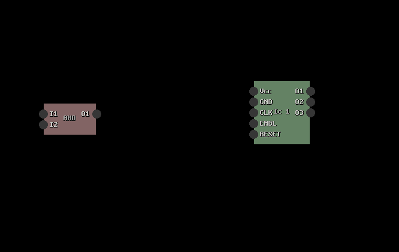

# LogiMax

Tiny Digital Circuit Simulator Tool written in C



# How to build

The project is self contained which means it comes with all dependencies.

run:

- `build.bat` on windows
- `build.sh` on linux

> Note: i prefer to use the `zig cc` compiler on windows. If you want to use a
> different one, lets say `gcc`, just edit the `build.bat` and change the
> following line:

```bash
set COMPILER=zig cc
```

to:

```bash
set COMPILER=gcc
```

# Features

- Tiny self contained binary ~110kb
- ...
